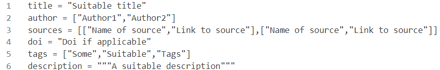

# P3 Explorer 

This webpage contains a collection of graphical representations of Performance, Portability and Productivity (P3) data which have been automatically generated using the [P3 Explorer Library](https://intel.github.io/p3-analysis-library/), Browse data on the Explore page or learn how to contribute your own data on the About page.

Created & Maintained by Matt Smith:

Email: ms3408@york.ac.uk  
[GitHub](https://github.com/Mxtt-smith) 
[LinkedIn](https://www.linkedin.com/in/matthew-smith-0b8842282/) 

# How to contribute

Data is submitted through pull requests to the GitHub repo, steps for how to submit are as follows:
1. Navigate to the submissions folder.
2. If the app you are submitting data for is present skip to step 6.
3. Create folder with your app as the name.
4. Create a readme.json within the folder, this should contain a short description of the application as well as the app domain (schema can be found below).
5. Within your folder create another folder named data.
6. Place all files for your submission in the data folder within your chosen apps folder.
7. Required files are a CSV containing performance data and a JSON file containing information about the submission, coverage data in a CSV is required for the Navchart plot however all other plots will work without it.
    - These files should be named as per the convention outlined at the bottom of this page. 
    - The schema for the JSON file can also be found below.
    - A visual representation of the directory structure for submissions can also be found below. 
10. Once you are ready, submit a pull request to the repository you will automatically be told whether your submission can be accepted or not.
11. All submissions will be subject to review to ensure they are of appropiate standard, we aim to complete this in a reasonable amount of time so please be patient!

### Data toml Format

<a href="docs/static/2024-07-example.toml" download>Download Example</a>
<a href="docs/static/template.toml" download> Download Schema</a>

### App toml Format
<a href="docs/static/appReadMe.toml" download>Download Example</a>
(Note the name of the app is taken from the app's folder name)
### Format of Submission Files

### Directory Structure
